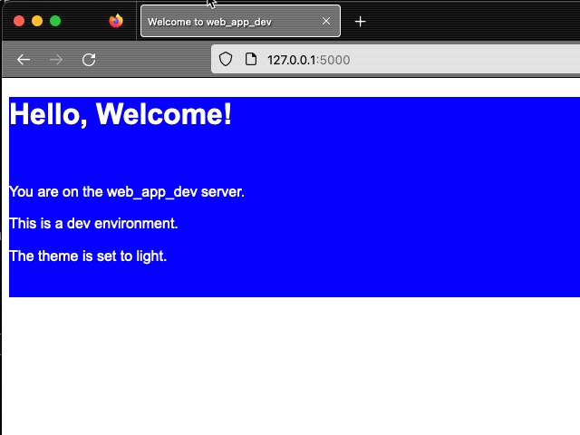
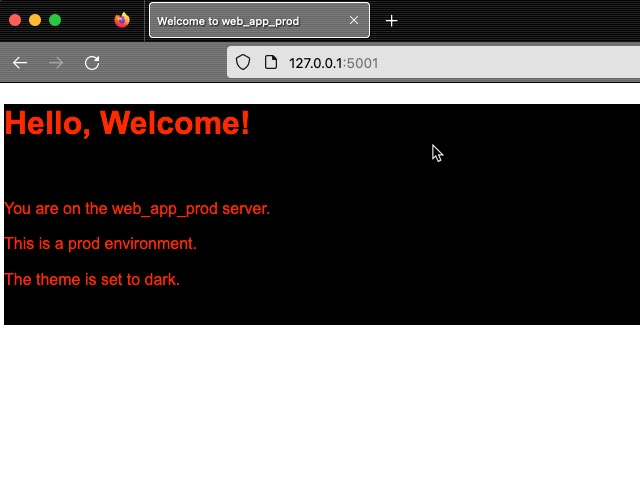

# ConfigurationParser Demo: Docker Compose File Generator for Python Web Application

Welcome to the Docker Compose File Generator for Python Web Applications! This demo script and configuration allow you to generate a Docker Compose file tailored for your development or production environment.

## Overview

The provided Python script reads the configuration from the `.ini` file and, based on the values provided therein, generates a Docker Compose configuration file. The configuration allows you to easily spin up a Python web application inside a Docker container using the desired environment settings. **⚠️ This script is meant for educational purposes to help you learn the concepts.**

## Getting Started

### Prerequisites

Before you can use the application, you need to install the required Python packages in your Python environment. You can do this by running:

```bash
pip install -r requirements.txt
```

### Configuration

You can customize the application's settings by modifying the `config.ini` file. It contains sections for default settings, development-specific settings, production-specific settings, theme settings, and logging settings.

For more details on the configuration, please refer to the comments inside the `config.ini` file.

### Running the Script

Once you've set up your desired configuration in the `config.ini` file, run the provided Python script. This will generate a `docker-compose.yml` file.

Once your environment is set up with the requirements you can modify the settings in `config.ini` and then run `script.py`:

```bash
python3 script.py
```

After generating the Docker Compose file with script.py, you can build and start the application by running:

```bash
docker compose up --build
```

### Output

Depending on the settings you use in the [config.ini](config.ini) file you can change different aspects of the web application.

#### Example 1

The .ini file setting set to `dev` and theme set to light.

```ini
[DEFAULT]
# Environment can be 'prod' for production or 'dev' for development
environment = dev

# The [web.app.theme] section contains theme settings for the application.
[web.app.theme]
# Theme type can be 'light' or 'dark'
type = light
```

Output:



#### Example 2

The .ini file setting set to `prod` and theme set to dark.

```ini
[DEFAULT]
# Environment can be 'prod' for production or 'dev' for development
environment = prod

# The [web.app.theme] section contains theme settings for the application.
[web.app.theme]
# Theme type can be 'light' or 'dark'
type = dark
```

Output:



## Notes

- Ensure you have Docker and Docker Compose installed on your machine to run the application. See <https://docs.docker.com/get-docker/> for more details.
- It is recommended that you have a python virtual environment set up.
- This README pertains only to this specific folder within the larger repo, so refer to other parts of the repository if you need more information on other aspects of the project.

---

Happy coding!
